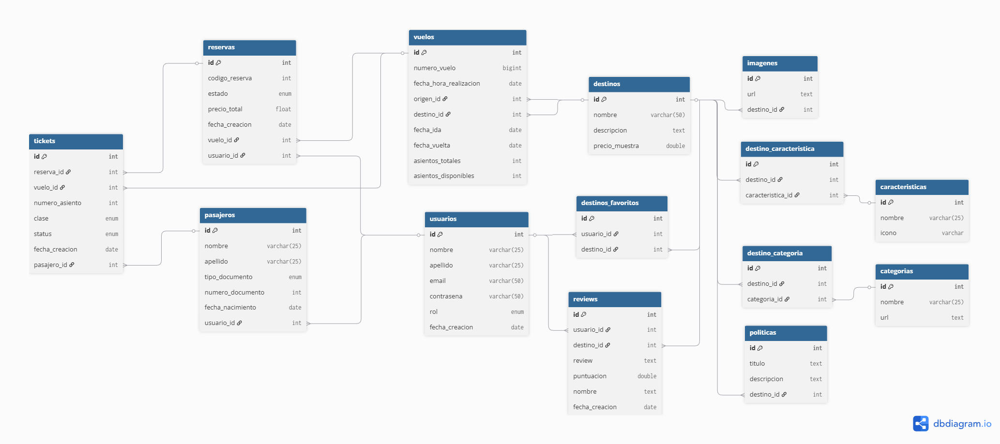

# ✈️ VuelosDH - Viajá más, viví mejor

VuelosDH es una plataforma de reserva de vuelos a destinos turísticos. Permite a los usuarios registrarse, explorar nuestros destinos, hacer reservas y deja favoritos. Los administradores pueden gestionar los destinos, categorías y usuarios.

---

## ⚙️ Tecnologías

### 🗄 Backend
- Java 17
- Spring Boot 3.2.x
- Spring Security + JWT
- Spring Data JPA
- MySQL
- Spring crea las tablas automáticamente y ejecuta data.sql creando contenido ejemplo para el repositorio.
- Es necesario el plugin de Lombok para la creación de Getters, Setters y Constructores.
- Se encuentra registrada la cuenta, email: admin@admin.com, passwod: adminA1!, que cuenta con rol de ADMIN.

### 🖥️ Frontend
- React 18 + Vite
- Axios
- React Router

---

FRONTEND_URL=http://localhost:5173
BACKEND_URL=http://localhost:8081

---

## 🚀 Instalación local

### 🧩 Requisitos previos
- Node.js 18+
- Java 17+
- MySQL

---

### 📦 Cloná el repositorio
```bash
git clone https://github.com/Beltravictor/-Desafio-profesional--Professional-Developer.git
cd aplicacion
```

---

## 🗂️ Diagrama de Entidades (ER)



> Creado con [https://dbdiagram.io](https://dbdiagram.io)

---

## 👮 PostMan Collection Para facilitar el testeo de APIs
https://www.postman.com/beltravictor/proyecto-final-professional-developer/collection/abuohwp/proyecto-final?action=share&source=copy-link&creator=45461434

---

## 🎨 Paleta de color usada para el proyecto:


---

## 👤 Autores

- [@beltravictor](https://github.com/beltravictor)

---

## 📄 Licencia
MIT
---

## 📞 Soporte
¿Encontraste un bug o tienes una sugerencia?

- 🐛 Reportar bug
- 💡 Solicitar feature
- 📧 Email: vbeltramino01@gmail.com
